# 🤖 OpenRouter Integration Setup Guide

This guide explains the **two-step process** for integrating OpenRouter with your Open WebUI instance, enabling access to multiple AI models including Perplexity Sonar for web search capabilities.

## 🎯 Understanding the Two-Step Process

### Step 1: Backend Configuration (Required First)
**Purpose:** Set up Docker container authentication with OpenRouter API  
**Tool:** `manage_openrouter.py` script  
**What it does:** Configures environment variables so the Docker container can connect to OpenRouter  
**Without this:** Manual UI model addition will fail with authentication errors  

### Step 2: UI Model Addition (Required Second)  
**Purpose:** Tell Open WebUI which specific models you want to use  
**Tool:** Open WebUI Admin Panel interface  
**What it does:** Creates "Direct Connections" for individual models  
**Without this:** You have authentication but no models appear in the selector  

## 🔄 Complete Workflow

```mermaid
graph TD
    A[Run manage_openrouter.py] --> B[Configure API Key]
    B --> C[Test Connection]
    C --> D[Restart Docker Services]
    D --> E[Backend Ready ✅]
    E --> F[Open WebUI Admin Panel]
    F --> G[Add Direct Connections]
    G --> H[Models Available in UI ✅]
```



## 📋 What is OpenRouter?

OpenRouter is a unified API that provides access to multiple AI models from different providers through a single interface. This includes:

- **Perplexity Sonar models** for real-time web search
- **Claude models** from Anthropic
- **GPT models** from OpenAI
- **Open-source models** like Llama, Mistral, and more
- **Cost optimization** through intelligent routing

## 🔧 Step 1: Backend Configuration

### Option 1: Interactive Setup (Recommended)

Run the backend configuration manager:

```bash
python3 manage_openrouter.py
```

This launches an interactive interface to:
- ✅ Configure your OpenRouter API key for Docker authentication
- 🧪 Test the backend connection
- 🔍 Discover and queue models for UI addition
- 📋 Generate copy-paste instructions for the UI
- 🐳 Restart Docker services with new configuration

### Option 2: Manual Backend Setup

1. **Get your OpenRouter API key**
   - Visit [https://openrouter.ai/keys](https://openrouter.ai/keys)
   - Create an account and generate an API key

2. **Create/update your .env file**
   ```bash
   cp env.example .env
   # Edit .env and add your API key
   ```

3. **Configure backend environment variables**
   ```bash
   ENABLE_OPENROUTER_API=true
   OPENROUTER_API_KEY=your_actual_api_key_here
   OPENROUTER_API_BASE_URL=https://openrouter.ai/api/v1
   ```

4. **Restart Docker services**
   ```bash
   docker-compose down
   docker-compose up -d
   ```

## 🖥️ Step 2: UI Model Addition

**Important:** OpenRouter models are added as **Direct Connections** in Open WebUI, not automatically loaded. This is intentional for performance and cost control.

### Manual UI Process:

1. **Open Open WebUI** in your browser (`http://localhost`)

2. **Access Model Management:**
   - Click on your profile/settings
   - Go to **Admin Panel** → **Settings** → **Connections**
   - Or look for **"Manage Direct Connections"**

3. **Add OpenRouter Connection for each model:**
   - Click **"+"** to add a new Direct Connection
   - **URL:** `https://openrouter.ai/api/v1`
   - **API Key:** Your OpenRouter API key (same as in .env)
   - **Name:** Give it a descriptive name (e.g., "Perplexity Sonar Pro")
   - **Model:** Copy the exact model ID (e.g., `perplexity/llama-3.1-sonar-large-128k-online`)

4. **Test the Connection:**
   - Click the test button to verify it works
   - You should see "success" ✅

5. **Repeat for each model** you want to use

6. **Models now appear** in your model selector dropdown!

### Using the Management Script for Easier UI Addition:

The `manage_openrouter.py` script includes features to make UI model addition easier:

1. **Discover & Queue Models** - Browse categorized models with descriptions
2. **View Queued Models** - Get copy-paste instructions for each model
3. **Export to File** - Save model information for reference

This helps you research models and get the exact information needed for the UI.

### Popular OpenRouter Models to Add:

**For Web Search:**
- `perplexity/llama-3.1-sonar-large-128k-online` - Real-time web search with large context
- `perplexity/llama-3.1-sonar-huge-128k-online` - Most powerful web search model
- `perplexity/llama-3.1-sonar-small-128k-online` - Fast, cost-effective web search

**For General Use:**
- `anthropic/claude-3.5-sonnet` - Best Claude model for reasoning and analysis
- `openai/gpt-4o` - Latest GPT-4 with vision and multimodal capabilities
- `meta-llama/llama-3.1-405b-instruct` - Largest open-source model

## 🔍 Using Perplexity for Web Search

Once you've added a Perplexity Sonar model:

### Example Usage:
1. Select the Perplexity Sonar model in Open WebUI
2. Ask questions that require current information:
   - "What are the latest developments in AI this week?"
   - "Current stock price of NVIDIA"
   - "Recent news about climate change"

The model will automatically search the web and provide up-to-date information with sources.

## 🛠️ Configuration Options

### Environment Variables (Backend Configuration)

| Variable | Default | Description |
|----------|---------|-------------|
| `ENABLE_OPENROUTER_API` | `true` | Enable/disable OpenRouter backend authentication |
| `OPENROUTER_API_KEY` | - | Your OpenRouter API key (required for Docker) |
| `OPENROUTER_API_BASE_URL` | `https://openrouter.ai/api/v1` | OpenRouter API endpoint |

### Docker Compose Integration

The OpenRouter backend configuration is automatically included in your `docker-compose.yaml`:

```yaml
environment:
  - ENABLE_OPENROUTER_API=${ENABLE_OPENROUTER_API:-true}
  - OPENROUTER_API_KEY=${OPENROUTER_API_KEY}
  - OPENROUTER_API_BASE_URL=${OPENROUTER_API_BASE_URL:-https://openrouter.ai/api/v1}
```

## 🧪 Testing Your Setup

### Backend Testing (Step 1)
```bash
python3 manage_openrouter.py
# Select "Test OpenRouter API Connection"
```

### Manual Backend Testing
```bash
curl -H "Authorization: Bearer YOUR_API_KEY" \
     https://openrouter.ai/api/v1/models
```

### UI Testing (Step 2)
1. Add a model as Direct Connection in UI
2. Test the connection in the UI
3. Select the model and try a simple question

## 🎨 Management Script Features

The `manage_openrouter.py` script provides:

- **🔧 Backend Configuration** - Set up Docker authentication
- **🧪 Connection Testing** - Verify backend authentication works
- **🔍 Model Discovery** - Browse categorized models with descriptions
- **📋 Model Queuing** - Select models and get UI addition instructions
- **🐳 Docker Integration** - Restart services with new configuration
- **📊 Status Dashboard** - View current backend configuration
- **❓ Built-in Help** - Documentation and workflow guidance

## 🔒 Security Best Practices

1. **Never commit API keys** to version control
2. **Use environment variables** for sensitive data (handled by script)
3. **Rotate API keys** regularly
4. **Monitor usage** on OpenRouter dashboard
5. **Set spending limits** if available

## 🐛 Troubleshooting

### Common Issues

**❌ "Models not appearing automatically"**
- **This is NORMAL!** OpenRouter models must be added manually as Direct Connections
- Follow Step 2: UI Model Addition above

**❌ "Backend authentication failed: HTTP 401"**
- **Cause:** API key not configured in backend (.env file)
- **Solution:** Run `manage_openrouter.py` → Configure API → Restart Docker

**❌ "UI Direct Connection fails with 401"**
- **Cause:** Backend not configured or Docker not restarted
- **Solution:** Complete Step 1 (Backend Configuration) first

**❌ "CORS errors in UI"**
- **Status:** This is normal for Direct Connections, models should still work
- **Solution:** Test the model by trying to use it for a conversation

**❌ "Permission denied on script"**
- **Solution:** `chmod +x manage_openrouter.py`

### Debug Steps

1. **Check backend configuration**
   ```bash
   python3 manage_openrouter.py
   # Select "View Current Backend Configuration"
   ```

2. **Test backend authentication**
   ```bash
   python3 manage_openrouter.py
   # Select "Test OpenRouter API Connection"
   ```

3. **Check Docker logs**
   ```bash
   docker-compose logs open-webui
   ```

4. **Verify environment variables**
   ```bash
   docker-compose config
   ```

## 🔗 Useful Links

- **OpenRouter Dashboard**: [https://openrouter.ai/](https://openrouter.ai/)
- **API Documentation**: [https://openrouter.ai/docs](https://openrouter.ai/docs)
- **Model Pricing**: [https://openrouter.ai/models](https://openrouter.ai/models)
- **Open WebUI Docs**: [https://docs.openwebui.com/](https://docs.openwebui.com/)

## 💡 Pro Tips

1. **Use the management script** for easier model discovery and queuing
2. **Add models one by one** to control costs and performance
3. **Use Perplexity Sonar** for questions requiring current information
4. **Monitor your usage** to avoid unexpected costs
5. **Give models descriptive names** when adding them as Direct Connections
6. **Test each model** after adding to ensure it works correctly
7. **Export your model queue** to a file for easy reference during UI addition

## 🆘 Getting Help

If you encounter issues:

1. **Check this guide** for the two-step process
2. **Run the management script** for interactive troubleshooting
3. **Verify you completed Step 1** (Backend Configuration) before Step 2
4. **Check Docker logs** for error messages
5. **Verify your API key** on the OpenRouter dashboard

---

**Happy AI chatting with OpenRouter! 🚀** 